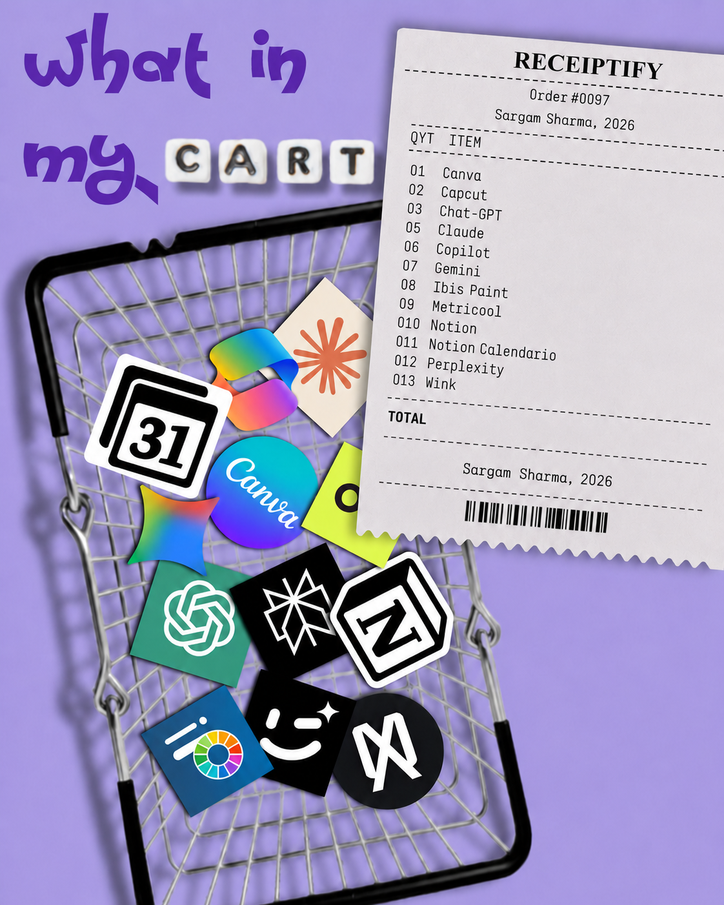

<h1 align="center">
  &nbsp;
  
</h1>

printf("Hola! 404: Sleep not found. ");
+ 🎓 CGPA: 9.51 | Class of 2028

<h3 align="center">connect with me ✦</h3>

<p align="center">
<a href="https://portfoliosargam.vercel.app/"></a>
<a href="https://www.linkedin.com/in/er-sargam-sharma/"></a>
<a href="mailto:sargam1086@gmail.com"></a>
<a href="https://codolio.com/profile/Sargam_786"></a>
<a href="https://www.geeksforgeeks.org/profile/sargam08"></a>
</p>

<table>
<tr>
<td>
<p align="center">&nbsp;</p>

+ 🔭 Automating tasks so future me can suffer in peace
+ 🐛 "Works on my machine" — patent pending
+ 🧩 Solving problems I invented approximately 24 hours ago
+ 🌀 Deploy first, panic accordingly
+ ☕ Open-source addict — because nothing says “fun weekend” like 47 merge conflicts and a mysterious `git push` panic.  
+ 🌱 Exploring **Data Structures & Algorithms** — mostly trying to bribe my code into cooperating.


</td>
<td>



</td>
</tr>
</table>


<h2 align="center">Tech Stack</h2>
 
<table width="100%">
<tr>
<td valign="top" width="50%">
Languages

<p>


</p>
</td>
<td valign="top" width="50%">
CS Fundamentals
 
<p>


</p>
</td>
</tr>
<tr>
<td valign="top" width="50%">
Data & ML
 
<p>


</p>
</td>
<td valign="top" width="50%">
Tools & Platforms
 
<p>


</p>
</td>
</tr>
</table>

The Real Coding Formula 😅

```text
const developer = { confidence: Math.random() }; // no correlation to actual skill

Real Code =
    if (worksOnFirstTry) {
        screenshot();               // for proof, no one will believe me
        developer.mood = "euphoric";
    } else {
        Debug();
        repeat until (willToLiveRunsOut);
        developer.mood = "questioning_life_choices";
    }
```
